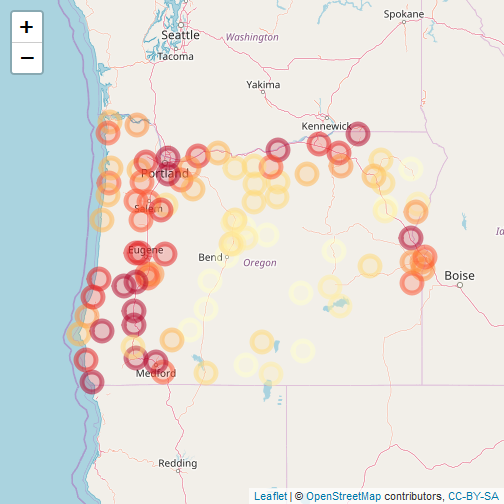

A starting test


```r
library(leaflet)
pal <- colorQuantile("YlOrRd", NULL, n = 8)
orstationc <- read.csv('inputs/orstationc.csv')
leaflet(orstationc) %>% 
		addTiles() %>%
		addCircleMarkers(color = ~pal(tann))
```

```
## Assuming "lon" and "lat" are longitude and latitude, respectively
```


